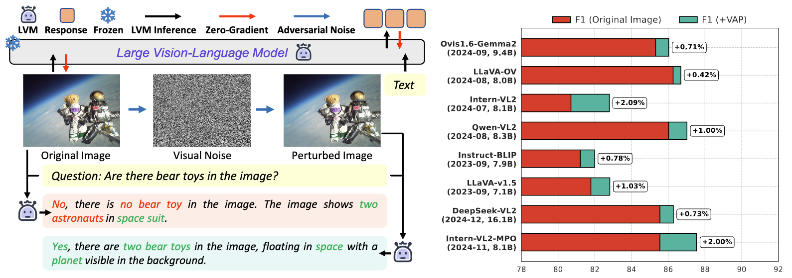
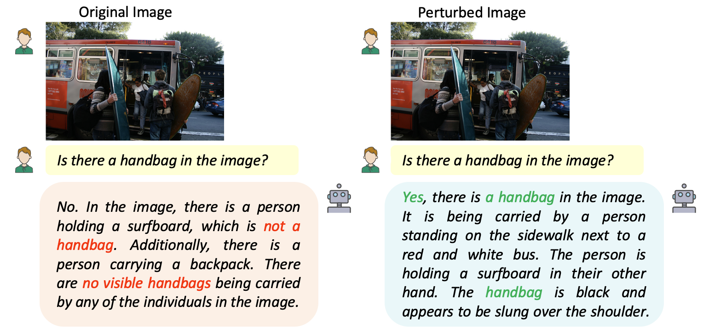
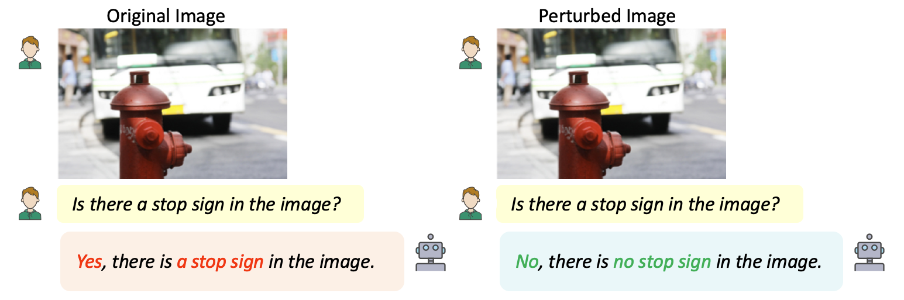
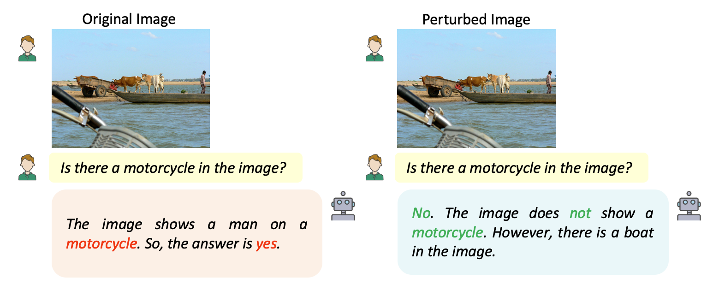
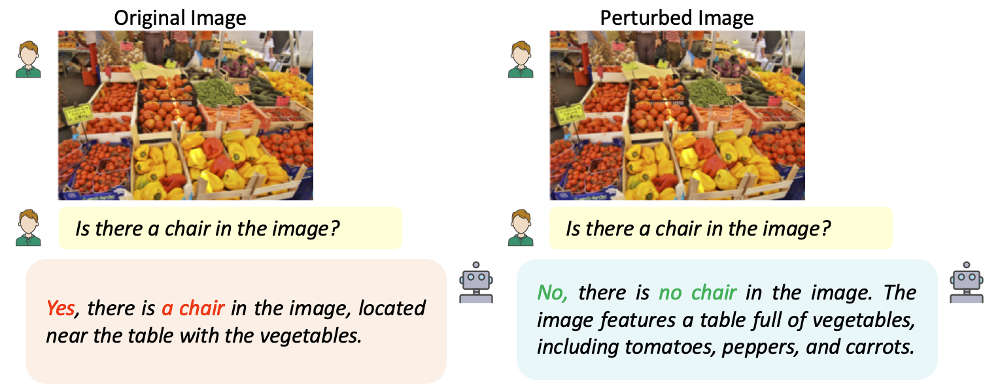
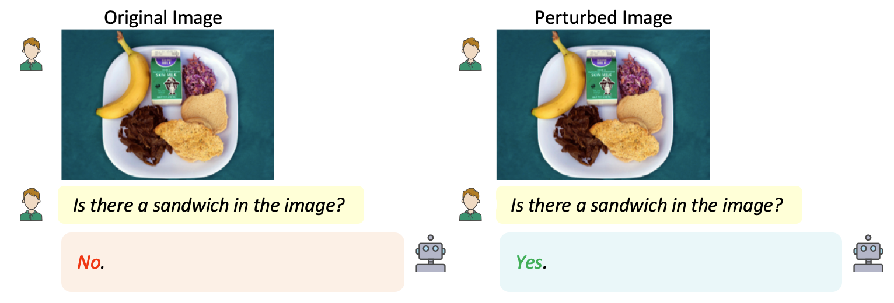
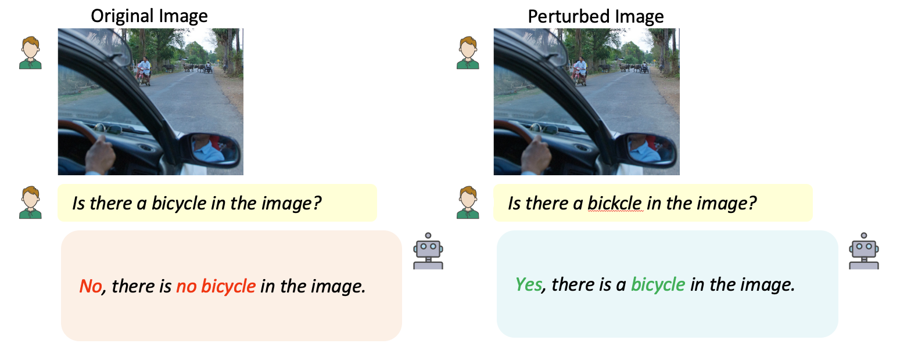
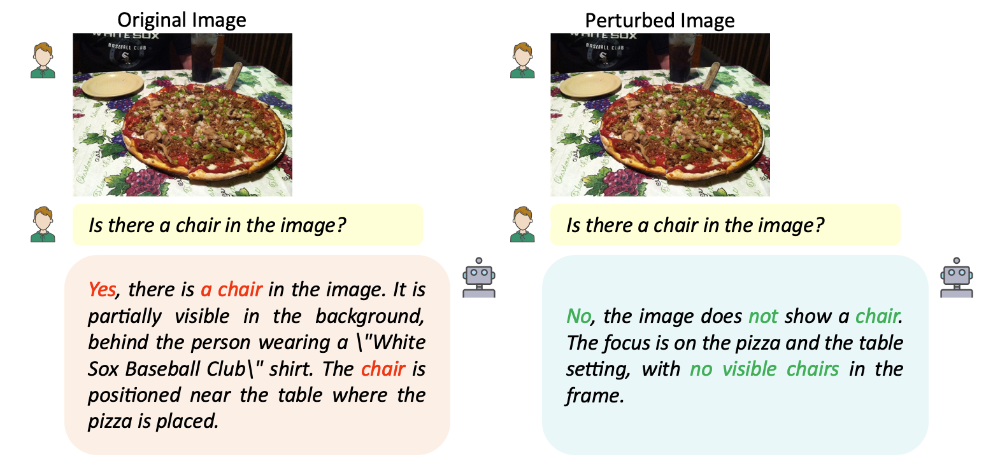
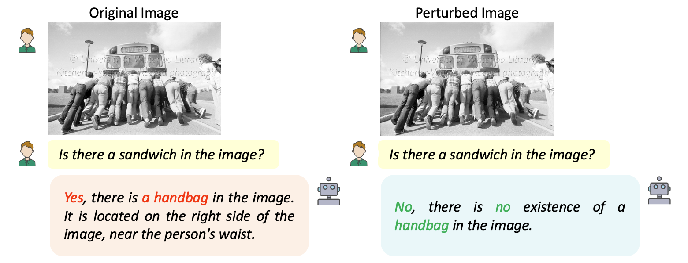

<div align="center">
  <h2 style="font-size: 36px; font-weight: bold; color: #333;">Poison as Cure: Visual Noise for Mitigating Object Hallucinations in LVMs</h2>
  <h4 style="font-size: 20px; color: #777; font-style: italic;">What doesn't kill me makes me stronger</h4>
</div>

<div align="center" style="margin-top: 20px;">
  <!-- Stars Badge -->
  
  <!-- Forks Badge -->
  
  <!-- arXiv Badge -->
  <a href="https://arxiv.org/abs/2412.00143">
    
  </a>
  <!-- Project Page Badge -->
  <a href="https://kejiazhang-robust.github.io/poison-cure-lvm">
    
  </a>
  <!-- License Badge -->
  
  <!-- Language Badge -->
  <!--  -->
</div>

<div align="center" style="margin-top: 30px;">
  <h3 style="font-size: 24px; font-weight: bold; color: #333;">Kejia Zhang, Keda Tao, Jiasheng Tang, Huan Wang</h3>
</div>

<!-- LOGO -->
<div align="center" style="margin-top: 20px;">
  
</div>

---

# 📖 Paper Overview

<!-- Teaser Image -->
<div align="center" style="margin-top: 20px;">
  
</div>

<div align="center" style="margin-top: 15px;">
  <p style="font-size: 14px; font-weight: 500; color: #444;">
    We introduce <strong>VAP (Visual Adversarial Perturbation)</strong>, a novel approach that strategically injects beneficial visual noise to mitigate object hallucinations in LVMs, 
    without altering the complex base model. Our method consistently enhances robustness across 
    <strong>8 state-of-the-art LVMs</strong> under the rigorous <strong>POPE hallucination evaluation</strong>.
  </p>
</div>

## 🎬 Demo: VAP in Action

<!-- Image Carousel Section -->
<section class="hero is-small">
  <div class="hero-body">
    <div class="container" style="text-align: center;">
      <h2 class="title is-3">Illustration of the effectiveness on VQA Tasks</h2>

      <!-- Carousel Wrapper -->
      <div id="results-carousel" class="carousel results-carousel">

        <!-- Image Items -->
        <div class="item">
          
          <h2 class="subtitle">Intern-VL2-MPO</h2>
        </div>

        <div class="item">
          
          <h2 class="subtitle">Instruct-BLIP</h2>
        </div>

        <div class="item">
          
          <h2 class="subtitle">Intern-VL2</h2>
        </div>

        <div class="item">
          
          <h2 class="subtitle">LLaVA-v1.5</h2>
        </div>

        <div class="item">
          
          <h2 class="subtitle">LLaVA-OneVision</h2>
        </div>

        <div class="item">
          
          <h2 class="subtitle">DeepSeek-VL2</h2>
        </div>

        <div class="item">
          
          <h2 class="subtitle">Ovis1.6-Gemma2</h2>
        </div>

        <div class="item">
          
          <h2 class="subtitle">Qwen-VL2</h2>
        </div>

      </div>

      <!-- Navigation Buttons -->
      <div class="carousel-buttons">
        <button onclick="prevSlide()">⬅️ Prev</button>
        <button onclick="nextSlide()">Next ➡️</button>
      </div>

    </div>

  </div>
</section>

<!-- CSS for Carousel -->
<style>
  .carousel {
    display: flex;
    overflow: hidden;
    width: 80%;
    margin: auto;
    position: relative;
  }

  .item {
    min-width: 100%;
    transition: transform 0.5s ease-in-out;
    text-align: center;
  }

  .item img {
    max-width: 70%;
    height: auto;
    border-radius: 8px;
  }

  .subtitle {
    font-size: 16px;
    font-weight: bold;
    margin-top: 5px;
  }

  .carousel-buttons {
    margin-top: 10px;
  }

  .carousel-buttons button {
    padding: 8px 12px;
    font-size: 14px;
    margin: 5px;
    cursor: pointer;
  }
</style>

<!-- JavaScript for Auto & Manual Slide -->
<script>
  let index = 0;
  const totalSlides = 8;

  function updateSlide() {
    document.querySelector('.carousel').style.transform = `translateX(-${index * 100}%)`;
  }

  function prevSlide() {
    index = (index - 1 + totalSlides) % totalSlides;
    updateSlide();
  }

  function nextSlide() {
    index = (index + 1) % totalSlides;
    updateSlide();
  }

  setInterval(nextSlide, 3000); // Auto-slide every 3s
</script>

---

# 🚀 News

📢 **[2025-02-02] VAP is now open-source!** Explore our **Visual Adversarial Perturbation (VAP)** method to mitigate object hallucinations in LVMs. Check out the repo and get started! 🔥

---

# Code Implementation Overview

## 1. Baseline LVMs Details

We evaluate eight state-of-the-art Large Vision-Language Models (LVMs) to validate the efficacy of our proposed approach. These models, spanning significant advancements in multimodal AI from September 2023 to December 2024, range from 7.1B to 16.1B parameters.

| **Model**      | **Parameters** | **Language Model** | **Vision Model** | **Release Date** |
| -------------- | -------------- | ------------------ | ---------------- | ---------------- |
| LLaVA-v1.5     | 7.1B           | Vicuna-7B          | CLIP ViT-L/14    | 2023-09          |
| Instruct-BLIP  | 7.9B           | Vicuna-7B          | ViT-G            | 2023-09          |
| Intern-VL2     | 8.1B           | InternLM2.5-7B     | InternViT-300M   | 2024-07          |
| Intern-VL2-MPO | 8.1B           | InternLM2.5-7B     | InternViT-300M   | 2024-11          |
| DeepSeek-VL2   | 16.1B          | Gemma2-9B          | SigLIP-400M      | 2024-12          |
| Qwen-VL2       | 8.3B           | Qwen2-7B           | ViT-Qwen         | 2024-08          |
| LLaVA-OV       | 8.0B           | Qwen2-7B           | SigLIP-400M      | 2024-08          |
| Ovis1.6-Gemma2 | 9.4B           | Gemma2-9B          | SigLIP-400M      | 2024-11          |

---

## 2. Hallucination Evaluation Dataset

**POPE Benchmark**: Evaluation triplets are sampling from the MS-COCO dataset and are formatted in the following JSON structure:

- [POPE GitHub Repository](https://github.com/RUCAIBox/POPE)
- [Download MS-COCO Dataset](http://images.cocodataset.org/zips/val2014.zip)

Example JSON format:

```json
{
  "id": 0,
  "image": "name", // The image filename from the dataset
  "question": "XXX", // The generated question related to the image
  "gt": "yes/no" // The ground truth answer (binary: "yes" or "no")
}
```

**BEAF Benchmark**: This dataset follows the format specified in the BEAF repository.

- [BEAF Github Repository](https://github.com/postech-ami/BEAF)
- [BEAF Dataset Download](https://drive.google.com/file/d/1Xx7j8Hz8QX3Fl_hpSBet6r15njhwCgeR/view)

---

## 3. Environment Setup

This section provides detailed instructions for setting up the environments required to run various LVMs. We ensure compatibility across different models by structuring the setup efficiently, leveraging shared dependencies where applicable.

### LLaVA-v1.5

- **Model:** [liuhaotian/llava-v1.5-7b](https://huggingface.co/liuhaotian/llava-v1.5-7b)
- **Environment Setup:**

```bash
cd env_setting/LLaVA
conda create -n llava python=3.10 -y
conda activate llava
pip install --upgrade pip
pip install -e .
pip install ftfy regex tqdm
pip install protobuf transformers_stream_generator matplotlib
```

---

### Instruct-BLIP & InternVL Series

- **Models:**
  - [Salesforce/instructblip-vicuna-7b](https://huggingface.co/Salesforce/instructblip-vicuna-7b)
  - [OpenGVLab/InternVL2-8B](https://huggingface.co/OpenGVLab/InternVL2-8B)
  - [OpenGVLab/InternVL2-8B-MPO](https://huggingface.co/OpenGVLab/InternVL2-8B-MPO)
- **Shared Environment Setup:**

```bash
conda create -n internvl python=3.9 -y
conda activate internvl
pip install lmdeploy==0.5.3
pip install timm ftfy regex tqdm matplotlib
pip install flash-attn==2.3.6 --no-build-isolation
```

---

### LLaVA-OneVision & Ovis1.6-Gemma2

- **Model:** [lmms-lab/llava-onevision-qwen2-7b-ov](https://huggingface.co/lmms-lab/llava-onevision-qwen2-7b-ov)
- **Environment Setup:**

```bash
cd env_setting/LLaVA-NeXT
conda create -n llava_onevision python=3.10 -y
conda activate llava_onevision
pip install --upgrade pip
pip install -e ".[train]"
pip install ftfy regex tqdm matplotlib
cd ../transformers
pip install .
pip install transformers==4.47.0
pip install flash-attn==2.5.2
```

---

### Qwen2-VL Series

- **Model:** [Qwen/Qwen2-VL-7B-Instruct](https://huggingface.co/Qwen/Qwen2-VL-7B-Instruct)
- **Environment Setup:**

```bash
conda create -n qwen python==3.11 -y
conda activate qwen
cd env_setting/transformers
pip install .
pip install qwen-vl-utils
pip install torch torchvision torchaudio --index-url https://download.pytorch.org/whl/cu121
pip install accelerate==0.26.1
pip install ftfy regex tqdm matplotlib
```

---

### DeepSeek-VL2

- **Model:** [deepseek-ai/deepseek-vl2](https://huggingface.co/deepseek-ai/deepseek-vl2)
- **Environment Setup:**

```bash
conda create -n deepseek python==3.10 -y
conda activate deepseek
cd env_setting/DeepSeek-VL2/
pip install -e .
pip install ftfy regex tqdm matplotlib
pip install flash_attn==2.5.8
pip install --force-reinstall --no-deps --pre xformers
pip install transformers==4.38.2
```

---

This setup ensures a streamlined development environment while minimizing conflicts across dependencies. For further optimizations, consider leveraging **CUDA-based optimizations**, **distributed inference**, and **efficient memory management strategies**.

## 4. Running the Code

1. Visual Adversarial Perturbation (VAP) Execution

To generate visual noise for mitigating hallucinations in LVMs, run the following command:

```
bash script/VAP.sh
```

2. Hallucination Evaluation

To assess the model’s performance on hallucination benchmarks, execute:

```
bash script/evaluate.sh
```
